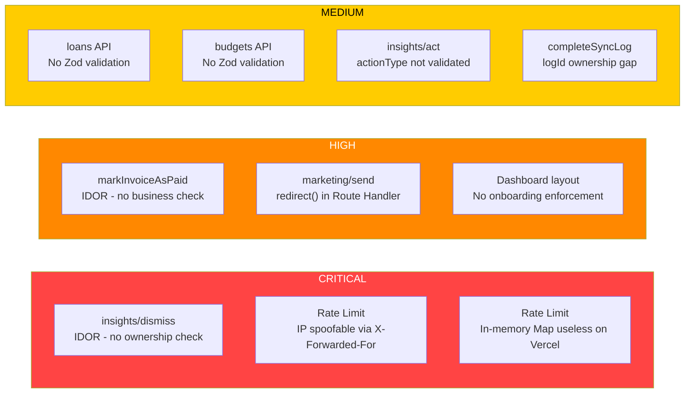
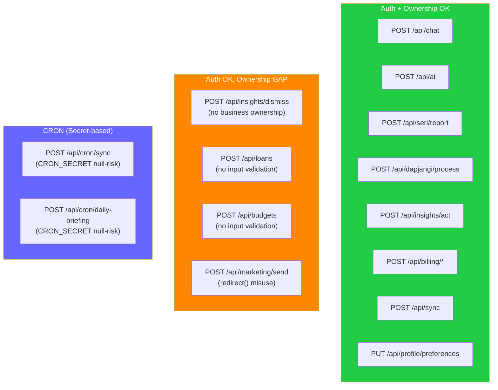
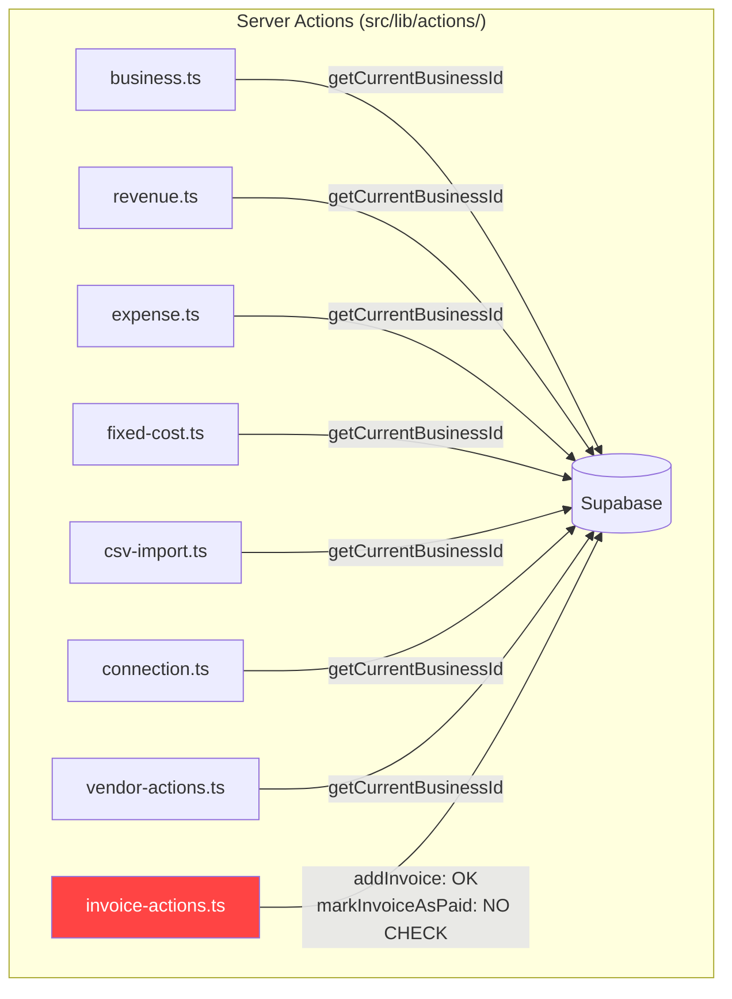
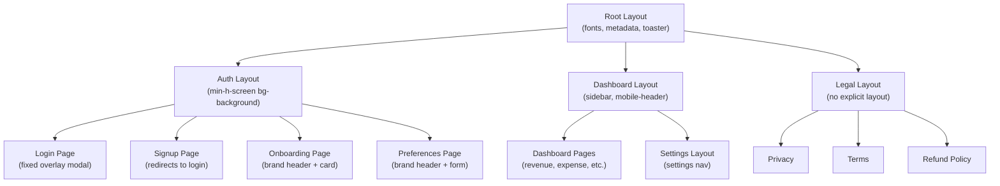

# sajang.ai System Audit Report

## 1. Auth Flow (Gap Detected)

```mermaid
flowchart TD
    A[User visits sajang.ai] --> B{Authenticated?}
    B -->|No| C[/auth/login]
    B -->|Yes| D{Has Business?}

    C --> E[Login / Signup]
    E --> F[Supabase Auth]
    F --> G[/auth/callback]
    G --> D

    D -->|Yes| H[/dashboard]
    D -->|No| I[/auth/onboarding]

    I --> J[Register Business]
    J --> K[/auth/onboarding/preferences]
    K --> H

    style L fill:#ff4444,color:#fff,stroke:#cc0000
    L["GAP: Dashboard layout does NOT redirect\nwhen business is null.\nUser can skip onboarding\nby navigating directly to /dashboard"]

    D -.->|"Direct URL access\n(no business)"| L
    L -.-> H
```

## 2. Security Vulnerability Map



## 3. API Route Auth Coverage



## 4. Data Flow - Server Actions



## 5. Layout Nesting


